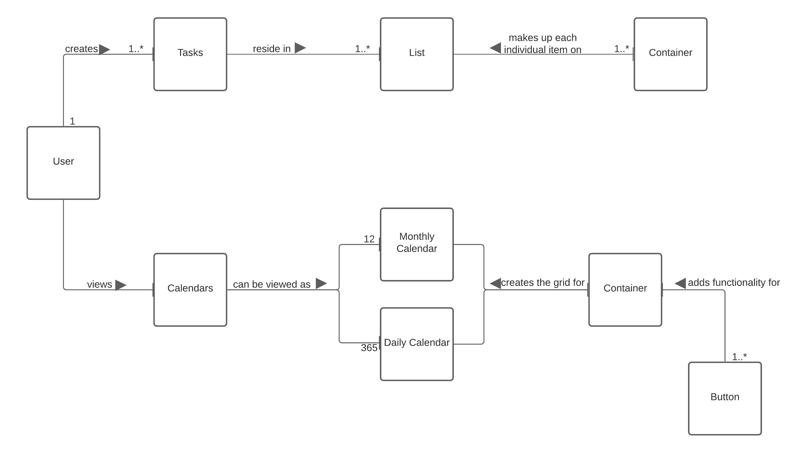
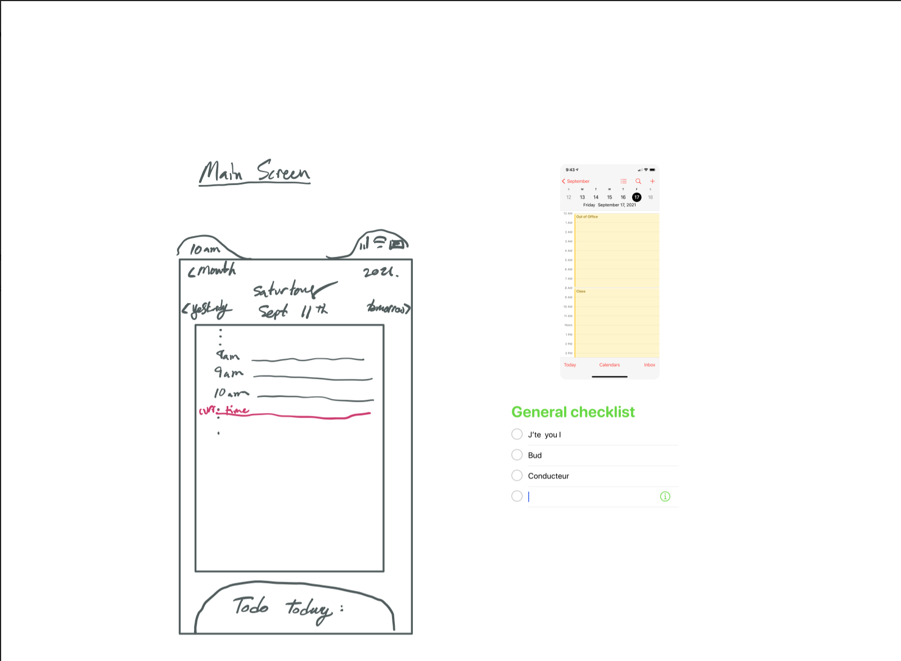
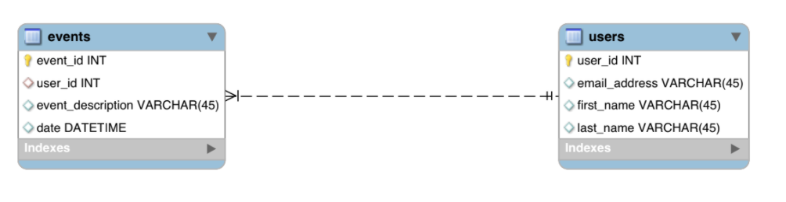

# Team 3 SWEN102.01 Design Document

## _Task Attack_

Track and organize the things you have to do on the days you have to do them.

### Executive Summary

#### Purpose

The purpose of this project is to build a new application to serve as an organizational tool for both tracking tasks and calendar events. The original idea of this application came about whilst discussing the disparity between “to-do list” style apps and Calendar apps. We decided on the novel idea to create our own application which takes the best features from both styles of apps in one. The ultimate goal is to provide users with an intuitive application that allows them to track tasks and manage dates without having to use separate applications.

### Project Requirements

#### Definition of MVP

The minimum viable product for this project would consist of a Swift iOS application that allows users to make events on their calendar and keep track of various tasks that may or may not be time sensitive. 

#### MVP Features

- As a user, I want to be able to **see the calendar** so that I can make my plans.

- As a user, I want to be able to **view the calendar by month as well as day** so that I can manage my long term events as well as my short term goals.

- As a user, I want to **create, edit, and delete tasks** from my to-do list so that I can manage what I have to do.

- As a user, I want to be able to **view my list of tasks for the current day** so that I know what I have to complete for the day.

#### Roadmap of Enhancements

_Potential Enahancements include:_

- Google Calendar synchronization

- Apple iCalendar synchronization

- The ability to view the calendar in a weekly layout

### Application Domain

#### Overview of Major Domain

The overall domain of this project can stretch from casual, everyday use to professional and academic settings. What’s so utilitarian about this application, is that almost everyone needs an intuitive method to manage their time and tasks. Whether you’re just a forgetful person and you need strict reminders, or you’re an executive who needs to watch the clock at all times, this application will serve many people from different backgrounds and uses.

#### Domain Area Detail

### Application Architecture

#### Summary

This application will be built primarily in the proprietary programming language from Apple, Swift, along with a collection of frameworks for user interfaces known as SwiftUI. In addition, the application will be utilizing a persistent, cloud-based database from Firebase.

#### Overview of User Interface

The User Interface will be built using Apple’s SwiftUI library which will be instrumental in achieving the aesthetic we are aiming for. In using this library, we can achieve a consistent UI/UX across the iOS system, since it will be sharing similar features and experiences; with our application being just as intuitive as many of the popular iOS apps of today.

#### Tier Designs (UI, Application, Model)

##### User Interface

##### Application

The application tier will be constructed using Apple’s Swift programming language. We will use Swift to create the logic layer that will process the information in between the UI and model tiers; in this case, between the SwiftUI elements and the Firebase database.

##### Model

The model, or data tier will be hosted using Firebase, a back-end, synchronous, realtime database.

